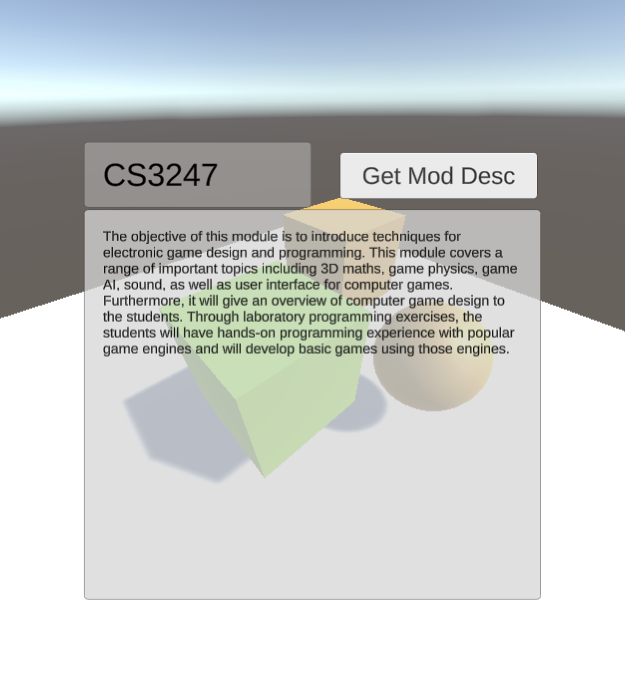
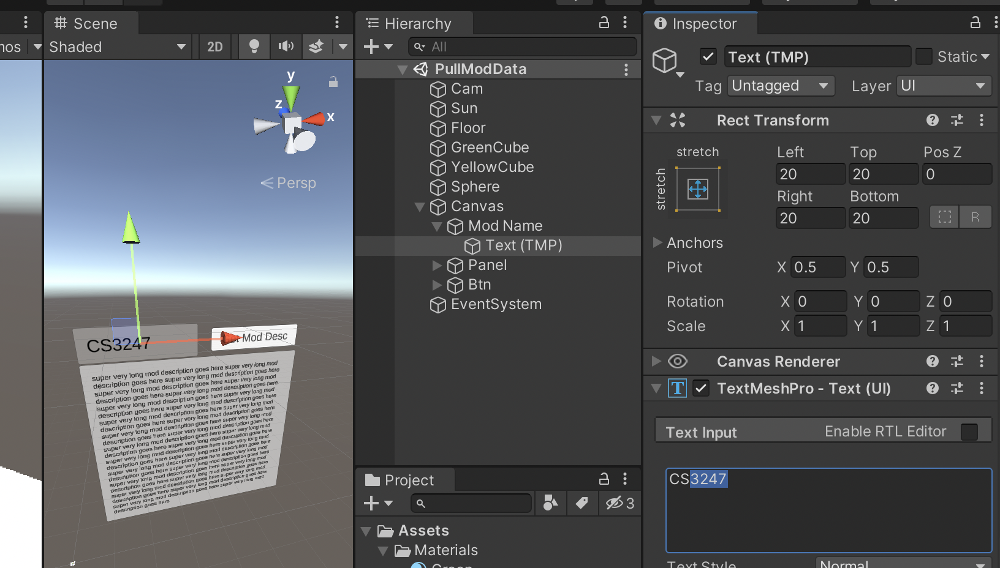

Unity NUSMODS API Test
---

this dummy project aims to

- use `UnityWebRequest` to `GET` information from a public REST API
- that API being used is NUSMODS
- the information is being displayed with a `TextMeshPro GameObject`

### Usage

- Install Unity Version 2020.3.24f1
- Open the project and Click `Play`
- Navigate to the pictured TMPro GameObject
- Change the module code's text field. If it is a valid module code for AY2022/23, it will load the description in the text field

To try other fields available on NUSMODS, refer to the API documentation from here https://api.nusmods.com/v2/#/

